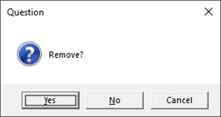

<style type="text/css">
h1.title {
  font-size: 38px;
  font-family: "Tahoma", sans-serif;
  color: #1F3600; /* darkgreen from DietDiveR logo */
}
h1 { /* Header 1 */
  font-size: 28px;
  color: #1F3600;
}
h2 { /* Header 2 */
    font-size: 22px;
  color: #1F3600;
}
h3 { /* Header 3 */
  font-size: 18px;
  color: #1F3600;
}
body{ /* Normal  */
  background-color: rgb(251, 251, 251);
  }
blockquote{ 
  font-size: 14px;
}
.list-group-item.active, .list-group-item.active:focus, .list-group-item.active:hover {
    background-color: #1F3600;
}
<!-- .navbar { -->
<!--   background-color: #882345; -->
<!--   padding-top: 0rem; -->
<!--   padding-bottom: 0rem; -->
<!-- } -->
</style>

<br>

# Introduction

In this tutorial, we will use mock data from the VVKAJ dataset that was created with [ASA24](https://epi.grants.cancer.gov/asa24/). VVKAJ stands for Vegetarian, Vegan, Keto, American, Japanese and was designed because these different eating patterns reflect differences that are often seen in real data. This mock dataset contains dietary for 15 mock participants who report dietary data while following the 5 different dietary patterns (VVKAJ) for three days. There are a total of XX dietary records in this dataset.

ASA24 data includes the following files: _Items.csv, _INS.csv, _Responses.csv, _TNS.csv, Totals.csv, and TS.csv. Refer to the ASA24 Reserchers’ website for specific explanations for each file, but for the purpose of this tutorial, we focus on using the Items.csv, which has all the food items reported by the participants.

In this script, you will:\

1. Use Metadata 1 to filter out individuals;
2. Remove users that has only a small number of totals (days of record) - if you know which one to remove; and
3. Look for outliers in your totals by nutrient consumed on each day.

<br>

# Load functions and packages  

Name the path to DietDiveR directory where input files are pulled.
```{r}
main_wd <- "~/GitHub/DietDiveR"
```

Load the necessary functions.
```{r}
source("lib/specify_data_dir.R")
source("lib/load_clean_ASA24.R")
source("lib/Food_tree_scripts/format.foods_2.r")
source("lib/QCOutliers.R")
source("lib/average.by.R")
```

You can come back to the main directory by:
```{r, eval=FALSE}
setwd(main_wd)
```

<br>

# Load ASA24 Items data

Specify the directory where the data is.
```{r, eval = FALSE}
SpecifyDataDirectory(directory.name= "eg_data/VVKAJ/")
```
<!-- [NOTE] SpecifyDataDirectory function is not executed by R markdown, but just showing  -->
<!--  the code so that this tutorial will have the same code as the R script.  -->

<!-- This is the R-markdown code to change directories. -->
```{r setup, include=FALSE}
knitr::opts_chunk$set(echo=TRUE)
knitr::opts_knit$set(root.dir = 'eg_data/VVKAJ')
```

Load your unprocessed (raw) food items-level data (as downloaded from the ASA24 study website).
The csv file will be loaded as a dataframe in R and be named as items_raw. 
```{r}
items_raw <- read.csv("Raw_data/VVKAJ_Items.csv", sep = ",", header=T)
```

`items_raw` has a column called "Food_Description", but this needs to be changed to "Main.food.description". Change the column name.
```{r}
names(items_raw)[names(items_raw) == "Food_Description"] <- "Main.food.description"
```

Check if any column names match with "Main.food.description". If there is a match, it will be printed.
```{r}
names(items_raw)[names(items_raw) == "Main.food.description"]
```

> **[NOTE]** The numbers in the square brackets of the output indicate the sequential number of each element to help count the number of elements. 

Save the items file as a .txt file. This command saves the object "items_raw" as a .txt file with the specified filename using the write.table function.
```{r}
write.table(items_raw, "VVKAJ_Items.txt", sep="\t", row.names=F) 
```

Special characters common in food names in dietary data such as `"`, `'`, `,`, `%` may interfere correct data loading in R; thus, we replace them with an underscore `_`.

<br>
Format foods so that special characters will be replaced with "_". "_f" stands for "formatted".
```{r}
FormatFoods(input_fn =  "VVKAJ_Items.txt", 
            output_fn = "VVKAJ_Items_f.txt")
```

> **[NOTE]** It is best practice to avoid overwriting your raw data. Always save formatted/manipulated versions as a new file as described above.

Load the Items_f.txt file to take a look at it.  
You need the `quote=""` and `colClasses="character"` arguments to ignore quotation marks (do not regard them as a cell separator) and to load all the columns as characters so that FoodID will keep the trailing ".0".
```{r}
items_f <- read.delim("VVKAJ_Items_f.txt", quote="", colClasses="character")
```

All special characters in the items data should have been replaced with an underscore in the Main.food.description column, the 3rd from the last column of the items_f. We can confirm that by using the head function, which shows the first six rows of the specified dataset by default. In this website version of tutorial, output is folded for visual clarity. You can click and expand the results.
```{r, eval=FALSE}
head(items_f)
```

<details>
  <summary>Click to expand output</summary>
```{r, echo=FALSE, eval=TRUE}
head(items_f)
```
</details>
<br>

Add a human-readable sample identifier (SampleID) with a desired prefix, and save it as a .txt file. SampleIDs are IDs unique to each combination of users and day and represent days of dietary intake in this dataset.
```{r}
AddSampleIDtoItems(input.fn="VVKAJ_Items_f.txt", user.name="UserName", recall.no="RecallNo", 
                   prefix="vvkaj.", out.fn="VVKAJ_Items_f_id.txt")
```

Load the formatted Items file with SampleID added.
```{r}
items_f_id <- read.delim("VVKAJ_Items_f_id.txt", quote="", colClasses="character")
```

A combination of the specified prefix and sequential number (vvkaj.00001) should be added in the SampleID column, the first column of the items_f_id dataframe. You will probably need to scroll up the output a little bit in the console to view the first column.  
```{r, eval=FALSE}
head(items_f_id)
```

<details>
  <summary>Click to expand output</summary>
```{r, echo=FALSE, eval=TRUE}
head(items_f_id)
```
</details>
<br>
Ensure your items file has the expected dimensions (number of rows x number of columns, shown as number of obs. and number of variables) in the environment window of R Studio. Or by using dim(items_f_id) and dim(items_raw). Note that items_f_id has 3 more columns than items_raw because new columns of FoodID, Old.Main.food.description, and SampleID have been added.
```{r}
  dim(items_f_id)
  dim(items_raw)
```

<br>

# Use `individuals_to_remove.txt` to filter out users marked as Remove = yes

Load your metadata that has information about which UserName(s) to remove.
```{r}
ind_to_rm <- read.delim("individuals_to_remove.txt")
```

Metadata for this purpose (ind_to_rm) has UserName and which one to be removed.
```{r}
ind_to_rm
```

Show which has "yes" in the "Remove" column. 
```{r}
subset(ind_to_rm, Remove == "yes")
```

<br>

As shown in the console, the user named "VVKAJ116" is marked to be removed. VVKAJ116 has only 1 day of data, which may not be complete, thus it is marked as an individual to remove.  However, be careful when deleting a datapoint from your study and never remove individuals from the raw dataset, to ensure you can always go back and include them if desired.

Remove the specified individuals.  
The output will be saved as a text file with the specified name. This assumes the usernames are in UserName column, and will print which user(s) will be removed.
```{r}
RemoveRows(data=items_f_id, metadata.file= ind_to_rm, 
           output.name= "VVKAJ_Items_f_id_s.txt")
```
  
Load the output for further processing.
```{r}
items_f_id_s <- read.delim("VVKAJ_Items_f_id_s.txt", quote="", colClasses="character")
```

Show unique usernames in items_f_id_s and confirm "VVKAJ116" has been removed.
```{r}
unique(items_f_id_s$UserName)  
```
  
<br>

# Merge individuals' metadata to items

`ind_metadata` has the participants' gender, age, height, weight, BMI, and Waist.Circumference, etc. If desired, this individual-specific information can be added to items data.

<br>
Load ind_metadata.txt.
```{r}
ind_metadata <- read.table("ind_metadata.txt", sep="\t", header=T)
```
  
Look at what the metadata has.
```{r}
head(ind_metadata)
```
This includes information on the removed individual, VVKAJ116, but it will not be used if VVKAJ116 is not in the items data.

Add this metadata of each participant to totals or items. 'NA' will be inserted to UserNames which are not in ind_metadata.
```{r}
items_f_id_s_m <- merge(x=items_f_id_s, y=ind_metadata, by="UserName", all.x=T)
```
  
Check that the items data and metadata are merged.
```{r, eval=FALSE}
head(items_f_id_s_m)
```

<details>
  <summary>Click to expand output</summary>
```{r, echo=FALSE, eval=TRUE}
head(items_f_id_s_m)
```
</details>
<br>

Furthermore, as a quick way to look at the metadata of only the selected individuals, you can subset the metadata to just the usernames present in the analysis dataset (items_f_id_s) using the `%in%` operator.
```{r}
ind_metadata_s <- ind_metadata[ind_metadata$UserName %in% items_f_id_s$UserName, ] 
```

Use the tail function to show the last six rows of ind_metadata_s. You can see that the last individual in this metadata is now VVKAJ117, and that VVKAJ116, which was not in items_f_id_s, has been omitted.
```{r, eval=FALSE}
tail(ind_metadata_s)
```

<details>
  <summary>Click to expand output</summary>
```{r, echo=FALSE, eval=TRUE}
tail(ind_metadata_s)
```
</details>
<br>

Save the merged dataframe as a .txt file.
```{r}
write.table(items_f_id_s_m, "VVKAJ_Items_f_id_s_m.txt", sep="\t", row.names=F, quote=F)
```

<br>

# Generate new totals file from the items file

Use one of the input files saved above as an input for calculating totals for. Specify which columns have usernames and Recall.No., which has the recorded days.
```{r}
GenerateTotals(inputfn =   "VVKAJ_Items_f_id_s_m.txt", 
               User.Name = "UserName", 
               Recall.No = "RecallNo",
               outfn =     "VVKAJ_Tot.txt")
```

Load the total file generated above.
```{r}
new_totals <- read.table("VVKAJ_Tot.txt", header=T, sep="\t")
```

The number of rows should be {No. of users x No. days}. For the example data, 16 users x 3 days = 48 rows (observations).
```{r}
nrow(new_totals) 
```

View the new_totals.
```{r, eval=FALSE}
head(new_totals)
```

<details>
  <summary>Click to expand output</summary>
```{r, echo=FALSE, eval=TRUE}
head(new_totals)
```
</details>
<br>

# Add the participants' metadata back to totals

Load ind_metadata.txt if you have not done so.
```{r}
ind_metadata <- read.table("ind_metadata.txt", sep="\t", header=T)
```

Add this metadata of each participant to totals.'NA' will be inserted to UserNames which are not in ind_metadata. 
```{r}
new_totals_m <- merge(x=new_totals, y=ind_metadata, by="UserName", all.x=T)
```

Check that the items data and metadata are merged.
```{r, eval=FALSE}
head(new_totals_m)
```

<details>
  <summary>Click to expand output</summary>
```{r, echo=FALSE, eval=TRUE}
head(new_totals_m)
```
</details>
<br>

Save the merged dataframe as a .txt file.
```{r}
write.table(new_totals_m, "VVKAJ_Tot_m.txt", sep="\t", row.names=F, quote=F)
```

<br>

# Calculate the mean of totals/participant

Calculate the mean of the totals data across all the days for each participant.
```{r}
AverageBy(data= new_totals, by= "UserName", start.col= "FoodAmt", end.col= "A_DRINKS",
          outfn="VVKAJ_Tot_mean.txt")
```

Load the output for further processing.
```{r}
new_totals_mean <- read.table("VVKAJ_Tot_mean.txt", header=T, sep="\t")
```

The number of rows should be equal to the number of users. This example data has 16 users, so there should be 16 rows of mean totals.
```{r}
nrow(new_totals_mean)
```

<br>

# Add the participants' metadata to the mean totals

Load ind_metadata.txt if you have not done so.
```{r}
ind_metadata <- read.table("ind_metadata.txt", sep="\t", header=T)
```
  
Add this metadata of each participant in the mean totals. 'NA' will be inserted to UserNames which are not in ind_metadata. 
```{r}
new_totals_mean_m <- merge(x=new_totals_mean, y=ind_metadata, by="UserName", all.x=T)
```
  
<br>

# Check that the mean totals and the users' metadata are merged.
```{r, eval=FALSE}
head(new_totals_mean_m, 1)
```

<details>
  <summary>Click to expand output</summary>
```{r, echo=FALSE, eval=TRUE}
head(new_totals_mean_m, 1)
```
</details>
<br>

Save the merged dataframe as a .txt file.
```{r}
write.table(new_totals_mean_m, "VVKAJ_Tot_mean_m.txt", sep="\t", row.names=F, quote=F)
```

<br>

# Quality Control (QC) for the mean totals data
 
Totals data may contain outliers due to errors in dietary reporting. These errors may be due to omission or inaccurate over- or under-estimation of portion size, leading to improbable nutrient totals. ASA24 provides [General Guidelines for Reviewing & Cleaning Data](https://epi.grants.cancer.gov/asa24/resources/cleaning.html#guidelines) for identifying and removing suspicious records. 
  
Here, we will identify records that contain values that fall outside typically observed ranges of kilocalories (KCAL), protein (PROT), total fat (TFAT), and vitamin C (VC). The ASA24 guide provides ranges of beta carotene (BCAR), too, however, outlier checking for BCAR is omitted in this tutorial but can be considered if you identify it as a nutrient that has a high variance in your study dataset.
  
> **[NOTE]** Your input dataframe (QCtotals) will be overwritten after each outlier removal.
>
> Run all these QC steps in this order. When asked, choose to remove the outliers that fall outside the specified range for each nutrient.

<br>

Load your totals if necessary - to be used as input for QC.
```{r}
new_totals_mean_m <- read.table("VVKAJ_Tot_mean_m.txt", sep="\t", header=T)
```
    
Split your dataset to males and females because different thresholds apply for males and females.
```{r}
new_totals_mean_m_M <- subset(new_totals_mean_m, Gender=="M")  
new_totals_mean_m_F <- subset(new_totals_mean_m, Gender=="F")  
```

<br>

---

## QC for males

Define your males totals dataset to be used as input.
```{r}
QCtotals <- new_totals_mean_m_M  
```


Flag if KCAL is <650 or >5700 &rarr; ask remove or not &rarr; if yes, remove those rows.
```{r, eval=FALSE}
QCOutliers(input.data = QCtotals, target.colname = "KCAL", min = 650, max = 5700)
```

This function will print out rows that fall outside the specified min-max range, and a dialogue box will appear outside the R Studio (shown below), asking whether to remove them. You should make sure to review these records carefully to double-check if the removal is warranted. It is possible to have a valid record that could meet the threshold for removal. Only you will know if you can trust the record when working with real data.



If you find potential outlier(s) here, click "No", and view those total(s) with their other nutrient intake information by running the following;
```{r}
KCAL_outliers <- subset(QCtotals, KCAL < 650 | KCAL > 5700)     
```

```{r}
# Sort the rows by KCAL and show only the specified variables.
KCAL_outliers[order(KCAL_outliers$KCAL, decreasing = T),
              c('UserName', 'KCAL', 'FoodAmt', 'PROT', 'TFAT', 'CARB')]  
```

<br>

If you think it is a true outlier, then run the QCOutliers command for KCAL again, and click "Yes" to remove the outlier. Here for this tutorial, we will remove this individual.

```{r}
QCOutliers(input.data = QCtotals, target.colname = "KCAL", min = 650, max = 5700)
```

Continue the QC process with other variables.

Flag if PROT is <25 or >240 &rarr; ask remove or not &rarr; if yes, remove those rows
```{r}
QCOutliers(input.data = QCtotals, target.colname = "PROT", min = 25, max = 240)
```

Flag if TFAT is <25 or >230 &rarr; ask remove or not &rarr; if yes, remove those rows
```{r}
  QCOutliers(input.data = QCtotals, target.colname = "TFAT", min = 25, max = 230)
```

Flag if VC (Vitamin C) is <5 or >400 &rarr; ask remove or not &rarr; if yes, remove those rows.
```{r}
QCOutliers(input.data = QCtotals, target.colname = "VC", min = 5, max = 400)
```

<br>

Name the males totals after QC.
```{r}
QCed_M <- QCtotals
```


<br>

---

## QC for females

Define your female totals dataset to be used as input.
```{r}
QCtotals <- new_totals_mean_m_F  
```

Flag if KCAL is <600 or >4400 &rarr; ask remove or not &rarr; if yes, remove those rows.
```{r, eval=FALSE}
QCOutliers(input.data = QCtotals, target.colname = "KCAL", min = 600, max = 4400)
```

Flag if PROT is <10 or >180 &rarr; ask remove or not &rarr; if yes, remove those rows
```{r}
QCOutliers(input.data = QCtotals, target.colname = "PROT", min = 10, max = 180)
```

Flag if TFAT is <15 or >185 &rarr; ask remove or not &rarr; if yes, remove those rows
```{r}
  QCOutliers(input.data = QCtotals, target.colname = "TFAT", min = 15, max = 185)
```

Flag if VC (Vitamin C) is <5 or >350 &rarr; ask remove or not &rarr; if yes, remove those rows.
```{r}
QCOutliers(input.data = QCtotals, target.colname = "VC", min = 5, max = 350)
```

<br>

Name the females totals after QC.
```{r}
QCed_F <- QCtotals
```

<br>

---

Combine the rows of M and F. 
```{r}
QCtotals_MF <- rbind(QCed_M, QCed_F)
```

Save as a .txt file.
```{r}
write.table(QCtotals_MF, "VVKAJ_Tot_mean_m_QCed.txt", sep="\t", quote=F, row.names=F)
```

<br>

# Adjust totals and items after QC

## Remove the QC-ed individual(s) from the totals to be consistent

In the previous section, we have removed individual(s) that did not pass the QC from mean total data. We will remove those individual(s) from the totals (before taking means of days), so that we will have the same individuals in the mean_total and total. 

Among the individuals in new_totals_m, retain only those in QCtotals_MF.
```{r}
new_totals_m_QCed <- new_totals_m[ new_totals_m$UserName %in% QCtotals_MF$UserName, ]
```

Save as a .txt file. This will be the total for each of the "QC-ed" individuals for each day, to be used for clustering analyses.
```{r}
write.table(new_totals_m_QCed, "VVKAJ_Tot_m_QCed.txt", sep="\t", quote=F, row.names=F)
```

## Similarly, remove the QC-ed individual(s) from the items to be consistent with the QC-ed averaged totals

Among the individuals in new_totals_m, pick up only those in QCtotals_MF.
```{r}
items_f_id_s_m_QCed <- items_f_id_s_m[ items_f_id_s_m$UserName %in% QCtotals_MF$UserName, ]
```

Save as a .txt file. This will be the items for each of the "QC-ed" individuals for each day, to be used for ordination etc.
```{r}
write.table(items_f_id_s_m_QCed, "VVKAJ_Items_f_id_s_m_QCed.txt", sep="\t", quote=F, row.names=F)
```

<br>  

---
Come back to the main directory before you start running another script.
```{r, eval=FALSE}
  setwd(main_wd)
```

<!-- This is to remove big white space at the end of the rendered html, which is produced due to toc_floating.  Source: https://stackoverflow.com/questions/52933437/how-to-remove-white-space-at-the-end-of-an-rmarkdown-html-output -->
<div class="tocify-extend-page" data-unique="tocify-extend-page" style="height: 0;"></div>
