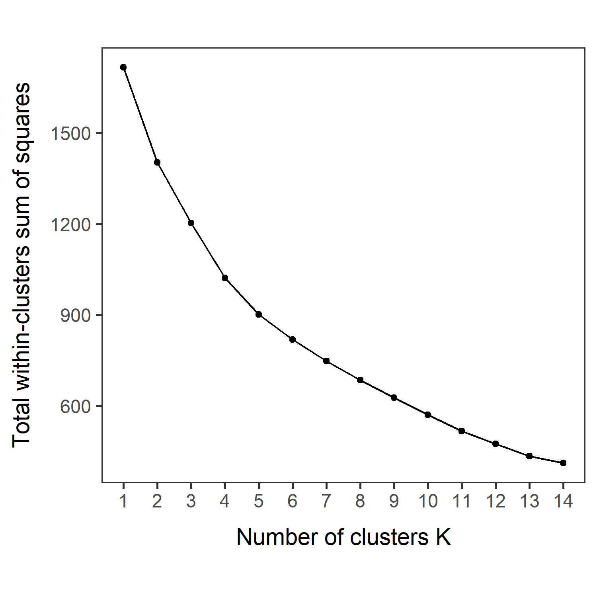
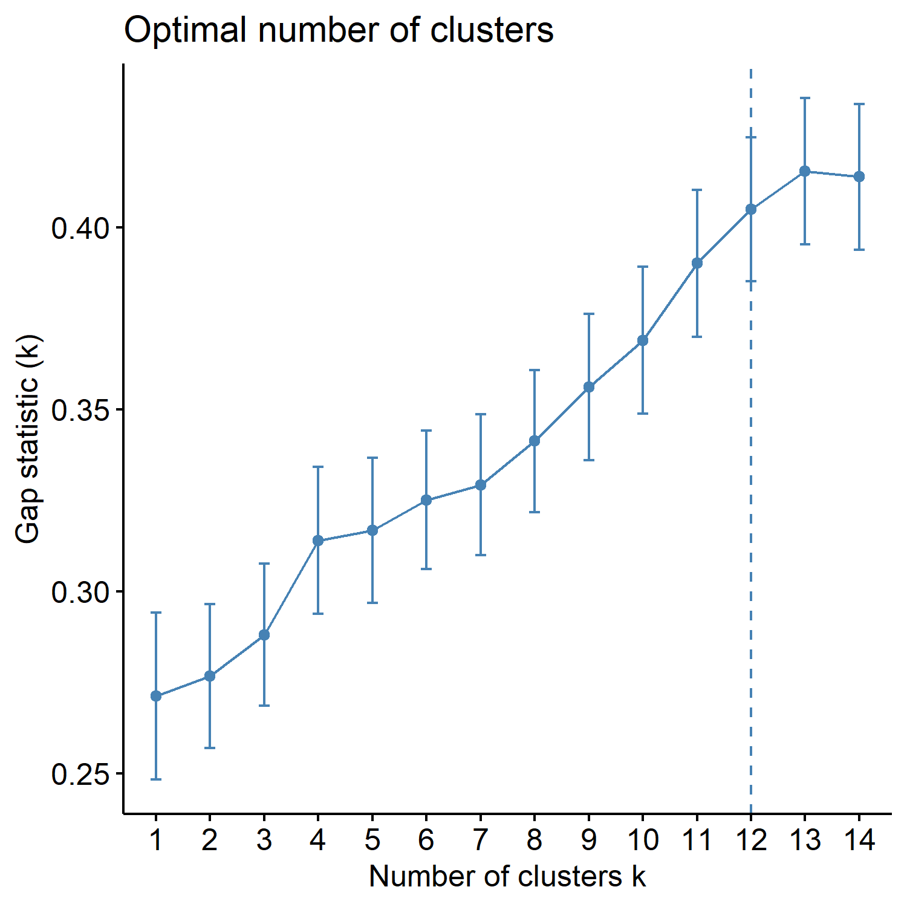
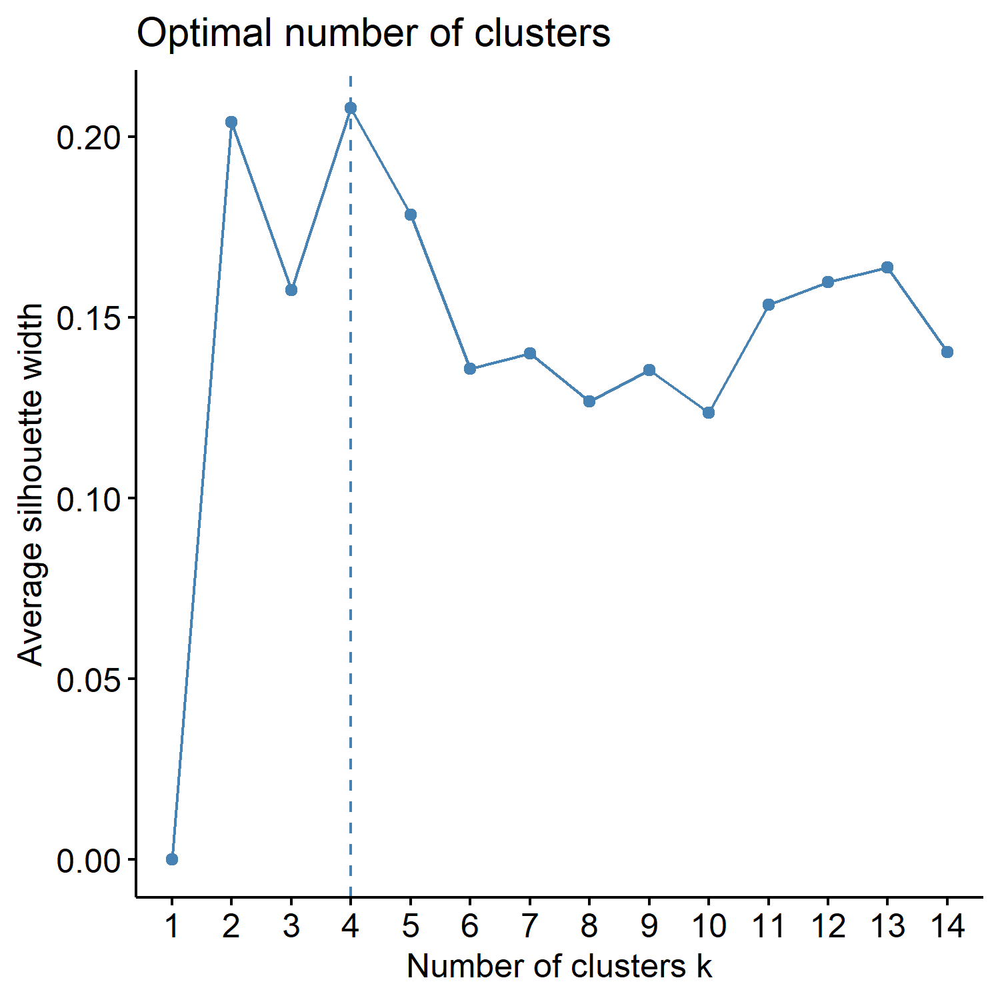

<style type="text/css">
h1.title {
  font-size: 38px;
  font-family: "Tahoma", sans-serif;
  color: #1F3600; /* darkgreen from DietDiveR logo */
}
h1 { /* Header 1 */
  font-size: 28px;
  color: #1F3600;
}
h2 { /* Header 2 */
    font-size: 22px;
  color: #1F3600;
}
h3 { /* Header 3 */
  font-size: 18px;
  color: #1F3600;
}
body{ /* Normal  */
  background-color: rgb(251, 251, 251);
  }
blockquote{ 
  font-size: 14px;
}
.list-group-item.active, .list-group-item.active:focus, .list-group-item.active:hover {
    background-color: #1F3600;
}
</style>

<br>

# Introduction

In this section, we are going to perform k-means analysis for each of Nutrient as is, Nutrient average, Food categories as is, and Food categories average.

Before proceeding, ensure to have four directories (folders) named as: 

- kmeans_Nut_asis
- kmeans_Nut_ave
- kmeans_Cat_asis
- kmeans_Cat_ave
  
K-means analysis results will be saved in this folder.  You can change those directory names, but if you do so, you will need to modify the directory name, “res_dir_xxx_xxxx”, to match your new directory name.


<br>

# Load functions and packages  

Name the path to DietDiveR directory where input files are pulled.
```{r}
main_wd <- "~/GitHub/DietDiveR"
```

Load necessary packages.
```{r}
library(ggplot2)
library(ggfortify)
library(cluster)
library(factoextra)
```

Set your ggplot2 theme.
```{r}
theme_set(theme_bw(base_size = 14))
```

Import source code to run the analyses to follow.
```{r}
source("lib/specify_data_dir.R")
source("lib/k-means.R")
```

You can come back to the main directory by:
```{r, eval=FALSE}
setwd(main_wd)
```

Specify the directory where the data is.
```{r, eval = FALSE}
SpecifyDataDirectory(directory.name= "eg_data/VVKAJ/")
```

<!-- This is the R-markdown code to change directories. -->
```{r setup, include=FALSE}
knitr::opts_chunk$set(echo=TRUE)
knitr::opts_knit$set(root.dir = 'eg_data/VVKAJ')
```

<br>

# Nutrient data as is, processed for clustering analyses

Load Nut_asis data.
```{r}
Tot_m_QCed_Nut_asis <- read.table(file="VVKAJ_Tot_m_QCed_Nut_asis_c_rv.txt", sep="\t", header=T)
```

Scale your input file and name it as k-means_input.
```{r}
kmeans_input <- scale(Tot_m_QCed_Nut_asis)
```

Ensure your input file has the correct number of rows and columns.
```{r}
dim(kmeans_input)
```

Specify the directory (folder) to save the results.
```{r}
res_dir_nut_asis = "kmeans_Nut_asis"
```

Specify the prefix of filenames to be saved.
```{r}
res_prefix_nut_asis = "VVKAJ_Nut_asis"
```

Run the elbow, silhouette, and gap methods to find an optimum K (number of clusters). Do not alter the name of the input file: `kmeans_input`. This function below assumes that the input is named as `kmeans_input`. You can only run those three methods for K = 1 through (number of observations - 1). The gap method output will be printed on the Console. The gap values are plotted in xxx_gapmethod.pdf. 
```{r}
ChooseK(out.dir= res_dir_nut_asis, out.prefix= res_prefix_nut_asis)
```

This code will generate three output files all at once in the res_dir_xxx_xxxx:
     
Output file postfix    |	File content
-------------------    | ---------------------------------------------------------------
_elbowmethod.pdf	     |	Shows total within−clusters sum of squares for each K.
_gapmethod.pdf	       |	Shows the Gap statistic (k) for each K, and if the factoextra package is used, the optimal K is marked by a dotted line.
_silhouettemethod.pdf	 |	Shows the Average silhouette width (~ goodness of fit) for each K, and if the factoextra package is used, the optimal K is marked by a dotted line.

<br>

Look at the three figures generated by the ChooseK function above. The elbow and gap methods did not give a distinct peak, but the silhouette method gave a peak at K=4. K=2, 3, 4, and 5 also have relatively high silhouette  width (~goodness of fit).

{width=50%}

<br>

{width=50%}

<br>

{width=50%}

<br>

With specific K values in mind, perform k-means analysis with one specified K. This will save Dim1 x Dim2 plot as a .pdf file in your out.dir. Change the filename as necessary.
```{r}
OneK(myK= 4, out.dir= res_dir_nut_asis, out.fn = "VVKAJ_Nut_asis_K4")
```

```{r,out.width="60%"}
oneKplot
```

Or try multiple Ks and print the biplots in one panel. Likewise, This will save a Dim1 x Dim2 plot for each of the chosen K as a .pdf file in your out.dir. Change the filename to be saved as a PDF as necessary. This MultipleK function uses the factoextra and gridExtra packages.
```{r}
MultipleK(myKs = c(2,3,4,5), out.dir = res_dir_nut_asis, out.fn = "VVKAJ_Nut_asis_K2-5")
```

<br>

# Nutrient data averaged across days, processed for clustering analyses
                                       
Load Nut_ave data.
```{r}
Tot_m_QCed_Nut_ave <- read.table(file="VVKAJ_Tot_mean_m_QCed_Nut_ave_c_rv.txt", sep="\t", header=T)
```

Scale your input file and name it as k-means_input.
```{r}
kmeans_input <- scale(Tot_m_QCed_Nut_ave)
```

Ensure your input file has the correct number of rows and columns.
```{r}
dim(kmeans_input)
```

Specify the directory (folder) to save the results.
```{r}
res_dir_nut_ave = "kmeans_Nut_ave" 
```

Specify the prefix of filenames to be saved.
```{r}
res_prefix_nut_ave = "VVKAJ_Nut_ave"
```

Run elbow, silhouette, and gap methods to find an optimum K (number of clusters).
```{r}
ChooseK(out.dir= res_dir_nut_ave, out.prefix= res_prefix_nut_ave)
```

With specific K values in mind, perform k-means analysis with one specified K.
```{r}
OneK(myK= 5, out.dir= res_dir_nut_ave, out.fn = "VVKAJ_Nut_ave_K5")  
```

```{r,out.width="60%"}
oneKplot
```

Try multiple Ks and print the biplots in one panel.
```{r}
MultipleK(myKs = c(2,3,4,5), out.dir = res_dir_nut_ave, out.fn = "VVKAJ_Nut_ave_K2-5")
```

<br>

# Food categories data as is, processed for clustering analyses

Load Cat_asis data.
```{r}
Tot_m_QCed_Cat_asis <- read.table(file="VVKAJ_Tot_m_QCed_Cat_asis_c_rv.txt", sep="\t", header=T)
```

Scale your input file and name it as k-means_input.
```{r}
kmeans_input <- scale(Tot_m_QCed_Cat_asis)
```

Ensure your input file has the correct number of rows and columns.
```{r}
dim(kmeans_input)
```

Specify the directory (folder) to save the results.
```{r}
res_dir_cat_asis = "kmeans_Cat_asis" 
```

Specify the prefix of filenames to be saved. 
```{r}
res_prefix_cat_asis = "VVKAJ_Cat_asis"
```

Run elbow, silhouette, and gap methods to find an optimum K (number of clusters). 
```{r}
ChooseK(out.dir= res_dir_cat_asis, out.prefix= res_prefix_cat_asis)
```

With specific K values in mind, perform k-means analysis with one specified K.
```{r}
OneK(myK=3, out.dir= res_dir_cat_asis, out.fn = "VVKAJ_Cat_asis_K3")
```

```{r,out.width="60%"}
oneKplot
```

Try multiple Ks and print the biplots in one panel.
```{r}
MultipleK(myKs = c(3,4,5,6), out.dir = res_dir_cat_asis, out.fn = "VVKAJ_Cat_asis_K3-6")
```

<br>

# Food categories data averaged across days, processed for clustering analyses

Load Cat_ave data.
```{r}
Tot_m_QCed_Cat_ave <- read.table(file="VVKAJ_Tot_mean_m_QCed_Cat_ave_c_rv.txt", sep="\t", header=T)
```

Scale your input file and name it as k-means_input.
```{r}
kmeans_input <- scale(Tot_m_QCed_Cat_ave)
```

Ensure your input file has the correct number of rows and columns.
```{r}
dim(kmeans_input)
```

Specify the directory (folder) to save the results.
```{r}
res_dir_cat_ave = "kmeans_Cat_ave" 
```

Specify the prefix of filenames to be saved.
```{r}
res_prefix_cat_ave = "VVKAJ_Cat_ave"
```

Run elbow, silhouette, and gap methods to find an optimum K (number of clusters).
```{r}
ChooseK(out.dir= res_dir_cat_ave, out.prefix= res_prefix_cat_ave)
```

With specific K values in mind, perform k-means analysis with one specified K.
```{r}
OneK(myK= 4, out.dir= res_dir_cat_ave, out.fn = "VVKAJ_Cat_ave_K4")  
```

```{r,out.width="60%"}
oneKplot
```

Try multiple Ks and print the biplots in one panel.
```{r}
MultipleK(myKs = c(2,3,4,6), out.dir = res_dir_cat_ave, out.fn = "VVKAJ_Cat_ave_K2-4&6")
```

<br>  

---
Come back to the main directory before you start running another script.
```{r, eval=FALSE}
  setwd(main_wd)
```

<!-- This is to remove big white space at the end of the rendered html, which is produced due to toc_floating.  Source: https://stackoverflow.com/questions/52933437/how-to-remove-white-space-at-the-end-of-an-rmarkdown-html-output -->
<div class="tocify-extend-page" data-unique="tocify-extend-page" style="height: 0;"></div>
