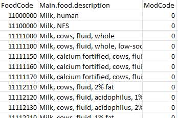
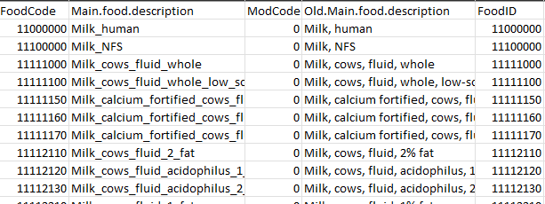
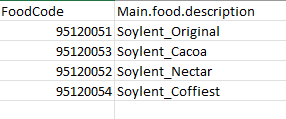
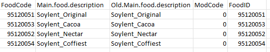
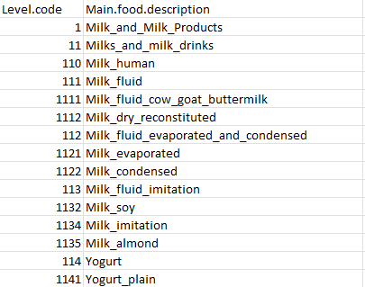

<style type="text/css">
h1.title {
  font-size: 38px;
  font-family: "Tahoma", sans-serif;
  color: #1F3600; /* darkgreen from DietDiveR logo */
}
h1 { /* Header 1 */
  font-size: 28px;
  color: #1F3600;
}
h2 { /* Header 2 */
    font-size: 22px;
  color: #1F3600;
}
h3 { /* Header 3 */
  font-size: 18px;
  color: #1F3600;
}
body{ /* Normal  */
  background-color: rgb(251, 251, 251);
  }
blockquote{ 
  font-size: 14px;
}
.list-group-item.active, .list-group-item.active:focus, .list-group-item.active:hover {
    background-color: #1F3600;
}
<!-- .navbar { -->
<!--   background-color: #882345; -->
<!--   padding-top: 0rem; -->
<!--   padding-bottom: 0rem; -->
<!-- } -->
</style>

<br>

# Introduction

Food trees show the classification of each food item entered in your dietary data. For details, please read [Johnson et al., 2021](https://doi.org/10.1016/j.chom.2019.05.005).

This brief script is to serve as an example of formatting and generating food trees with your own dataset. This script demonstrates how to: 

1. Format food list containing "Main.food.description" and "ModCode" by using the FormatFood function.   
2. Build a food tree with the entire list of food items in "all.food.desc.txt".
3. Visualize the food tree you have created in step 2.

The functions in Food_tree_scripts folder expects that the input files are tab-delimited txt file with no special characters that impede correct loading, such as:  
"  
'  
#  
&  

So, we will use the FormatFoods function to replace special characters in the food description column with underscores.

<br>

# Load functions and packages  

Name the path to DietDiveR directory where input files are pulled.
```{r}
main_wd <- "~/GitHub/DietDiveR"
```

<br>

## Load the packages/scripts necessary for tree building
  
Load the reshape2 package necessary for tree building, and if it is not installed, install it.
```{r}
if (!require("reshape2", quietly = TRUE))install.packages("reshape2")
```

Load the data.tree package necessary for newick.tree.r, and if it is not installed, install it.
```{r}
if (!require("data.tree", quietly = TRUE))install.packages("data.tree")
```


Load functions necessary for foodtree building.
```{r}
source("lib/specify_data_dir.R")
source("lib/Food_tree_scripts/newick.tree.r")
source("lib/Food_tree_scripts/check.db.r")
source("lib/Food_tree_scripts/format.foods_2.r")
source("lib/Food_tree_scripts/filter.db.by.diet.records.r")
source("lib/Food_tree_scripts/make.food.tree.r") # This needs 'newick.tree.r' already loaded.
source("lib/Food_tree_scripts/make.food.ifc.r")
source("lib/Food_tree_scripts/make.fiber.ifc.r")
source("lib/Food_tree_scripts/make.dhydrt.ifc.r")
```

<br>

---

## Load the packages/scripts necessary for tree visualization

If you have not downloaded and installed the ggtree package yet,you can do so by first installing BiocManager (if you have not done so):
```{r}
if (!require("BiocManager", quietly = TRUE))install.packages("BiocManager")
```

Then, use BiocManager to install the "ggtree" package.
```{r,eval=FALSE}
BiocManager::install("ggtree")
```

Load the functions necessary to visualize foodtrees.
```{r}
library(ggtree)
source("lib/viz_food_tree.r")
```

<br>

You can come back to the main directory by:
```{r, eval=FALSE}
setwd(main_wd)
```


<br>

# Load and prepare items data
 
Food trees show the classification of each food item entered in your dietary data. For details, please read [Johnson et al., 2021](https://doi.org/10.1016/j.chom.2019.05.005).
  
Move to "Food_tree_eg" directory.
```{r}
SpecifyDataDirectory(directory.name = "eg_data/Food_tree_eg/")
```

<!-- This is the R-markdown code to change directories. -->
```{r setup, include=FALSE}
knitr::opts_chunk$set(echo=TRUE)
knitr::opts_knit$set(root.dir = 'eg_data/Food_tree_eg/')
```

Replace special characters such as quotation marks, "%", with "_", and create a new FoodID out of foodcode and modcode connected with a period.  The FormatFoods function will leave all other columns intact.
```{r}
FormatFoods(input_fn= "all.food.desc.txt", 
            output_fn="all.food.desc_formatted.txt")
```

<br>

all.food.desc.txt

{width=45%}

<br>

all.food.desc_formatted.txt

{width=80%}

<br>

---

You can also create a list of FoodCode and Main.food.description of additional foods not in ASA24 that you would like to include in the analysis. As an example, Soylent_codes.txt has two columns: FoodCode and Main.food.description. You can generate food codes for the food items unique to your dataset. Be sure to use a nine-digit number that is not already in the all.food.desc.txt.

<br>

Soylent_codes.txt

{width=40%}

<br>

Format this soylent_codes.txt for use - replace special characters with "_". There are no special characters in this file, so Main.food.description will result in the same as Old.Main.food.description with this particular file.
```{r}
FormatFoods(input_fn= "Soylent_codes.txt", 
            output_fn="Soylent_codes_formatted.txt")
```


<br>

Soylent_codes_formatted.txt

{width=70%}

<br>

# Generate a food tree with the whole ASA24 food database

Create a folder called "Food_tree_all_ASA24" within "Food_tree_eg" folder to save the output.
  
Generate a tree with the whole ASA24 food database first as a reference. The file specified by the addl_foods argument will be added to that specified by food_database_fn. NodeLabelsMCT.txt has the full classification level of each food items and its Main.food.description. The classification level (num.levels) will be the basis of hierarchical food tree generation.
```{r}
MakeFoodTree(nodes_fn=         "NodeLabelsMCT.txt", 
             food_database_fn= "all.food.desc_formatted.txt", 
             addl_foods_fn=    "Soylent_codes_formatted.txt", 
             num_levels= 4,
             output_tree_fn=    "Food_tree_all_ASA24/ASA24_4Lv.tree.nwk",
             output_taxonomy_fn="Food_tree_all_ASA24/ASA24_4Lv.tax.txt")  
```


Arguments | Description
--------- | -----------
nodes_fn |          food level (node) information for each food item.
food_database_fn |   whole ASA24 database to use. 
addl_foods_fn |      additional foods that are not in ASA24 database but you would like to add; soylent_codes in this case.  If none, enter "NULL" instead.
num_levels |         number of food levels (1 - 5) to save.
output_tree_fn |      output tree file name. Should end with ".nwk".
output_taxonomy_fn| output taxonomy file (to be used later) name.

<br>

The nodes_fn argument specifies the food level (node) information for each food item. <span style="color: red;">NodeLabelsMCT.txt</span> has the classification level of each food items and its Main.food.description.  The classification level will be the basis of hierarchical food tree generation.

<br>

NodeLabelsMCT.txt

{width=50%}

<br>

---

# Visualize your food tree

## Load the generated food tree

This will load the .nwk file and save it as a tree object called "tree".
It is OK to see a message saying:  
Found more than one class "phylo" in cache; using the first, from namespace 'phyloseq'  
Also defined by 'tidytree'

```{r}
tree <- read.tree("Food_tree_all_ASA24/ASA24_4Lv.tree.nwk")
```

```{r,out.width="60%"}
tree
```

Prepare node labels of L1 for plotting. It assumes that the tree file has nine L1 levels.
```{r}
PrepFoodTreePlots(input.tree=tree)
```

<br>

## Create a color-coded and annotated food tree with nine L1 levels 

It is OK to see some warning messages about Coordinate system and scale for 'y' already being present.
```{r}
VizFoodTree(input.tree=tree, layout="circular")
```

Look at the color-coded and annotated food tree, saved as `annotated_tree`.
```{r message=FALSE, warning=FALSE}
annotated_tree
```

Save the tree as a PDF file.
```{r message=FALSE, warning=FALSE}
ggsave("Food_tree_all_ASA24/ASA24_4Lv.tree.pdf",
       annotated_tree, device="pdf", width=6, height=6, units="in", dpi=300)
```


<br>  

---
Come back to the main directory before you start running another script.
```{r, eval=FALSE}
setwd(main_wd)
```

<!-- This is to remove big white space at the end of the rendered html, which is produced due to toc_floating.  Source: https://stackoverflow.com/questions/52933437/how-to-remove-white-space-at-the-end-of-an-rmarkdown-html-output -->
<div class="tocify-extend-page" data-unique="tocify-extend-page" style="height: 0;"></div>
