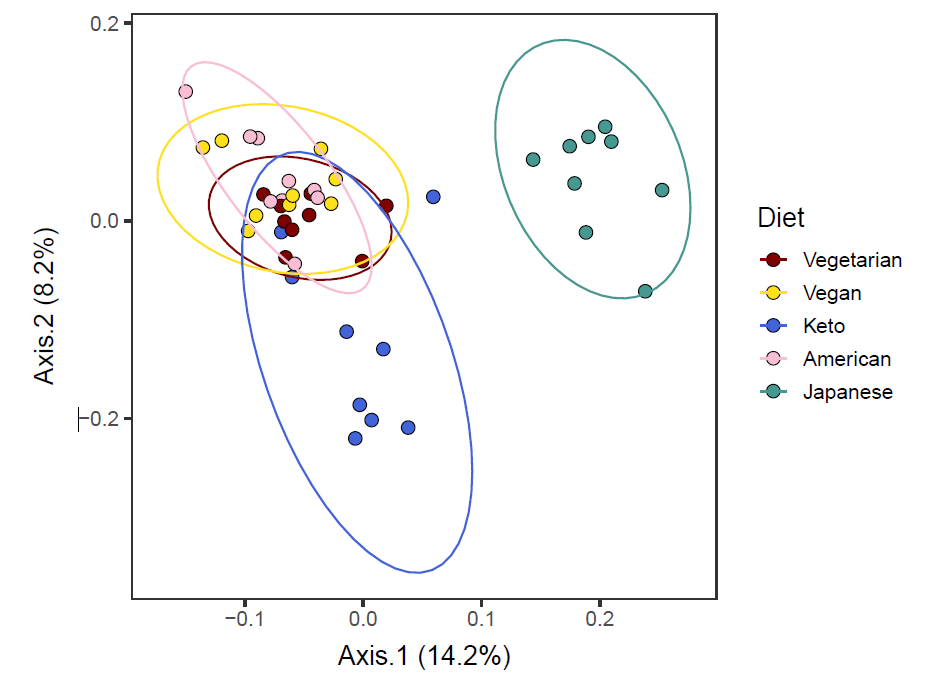

<style type="text/css">
h1.title {
  font-size: 38px;
  font-family: "Tahoma", sans-serif;
  color: #1F3600; /* darkgreen from DietDiveR logo */
}
h1 { /* Header 1 */
  font-size: 28px;
  color: #1F3600;
}
h2 { /* Header 2 */
    font-size: 22px;
  color: #1F3600;
}
h3 { /* Header 3 */
  font-size: 18px;
  color: #1F3600;
}
body{ /* Normal  */
  background-color: rgb(251, 251, 251);
  }
blockquote{ 
  font-size: 14px;
}
.list-group-item.active, .list-group-item.active:focus, .list-group-item.active:hover {
    background-color: #1F3600;
}
</style>


<br>

# Introduction

In this section, we will take the phylogeny of food items into account in clustering individuals according to their dietary data. In order to do so, we will use [the phyloseq package](https://joey711.github.io/phyloseq/index.html), which uses phylogeny of microbes and their abundance. We will replace microbes with food items consumed by our dietary study participants.

<br>  

# Load the necessary packages and functions

Name your main directory for future use.
```{r}
main_wd <- "~/GitHub/DietDiveR"
```

<br>

---

If you have not downloaded and installed the phyloseq package yet, you can do so by first installing BiocManager (if you have not done so):
```{r}
if (!require("BiocManager", quietly = TRUE)) install.packages("BiocManager")
```

Then download and install the phyloseq package.
```{r,eval=FALSE}
BiocManager::install("phyloseq")
```

Install the devtools package necessary for installing the pairwiseAdonis package.
```{r}
if (!require("devtools",    quietly = TRUE))install.packages("devtools")
```

Install pairwise adonis function from Github. (https://github.com/pmartinezarbizu/pairwiseAdonis)
```{r,eval=FALSE}
devtools::install_github("pmartinezarbizu/pairwiseAdonis/pairwiseAdonis")
```

<br>

---

load the necessary packages.
```{r}
library(phyloseq)
library(ggtree)
library(pairwiseAdonis)
```

Load necessary functions and ggplot formatting themes.
```{r}
source("lib/specify_data_dir.R")
source("lib/ordination.R")
source("lib/ggplot2themes.R")
source("lib/sort_IFC_by_ID.R")
source("lib/plot.axis.1to4.by.factor.R")
```

Load the distinct 100 colors for use.
```{r}
distinct100colors <- readRDS("lib/distinct100colors.rda")  
```

You can come back to the main directory by:
```{r,eval=FALSE}
setwd(main_wd)
```

<br>

# Create a phyloseq object for ordination

Specify the directory where the data is.
```{r}
SpecifyDataDirectory(directory.name = "eg_data/VVKAJ/")
```

<!-- This is the R-markdown code to change directories. -->
```{r setup-1, include=FALSE}
knitr::opts_chunk$set(echo=TRUE)
knitr::opts_knit$set(root.dir = 'eg_data/VVKAJ/')
```

<br>

## Load files for creating a phyloseq object

### Food

Load IFC table, and sort the columnnames (userID), leaving the last column (taxonomy) intact. This dataframe will be saved as `food`. Also, save `food` as a .txt file to be used in the "correlation between Axes and foods" section.
```{r}
SortIFCByID(ifc.input =           "Foodtree/VVKAJ_Items_f_id_s_m_QCed_4Lv.food.ifc.txt",
            outfn.for.corr.axis = "Foodtree/VVKAJ_Items_f_id_s_m_QCed_4Lv.food.ifc_sorted.txt")
```

`food` is a matrix of Food descriptions (rows) x SampleID (columns).
```{r}
head(food)[1:6, 1:4]
```

Format the food object and create an ifc_table called `IFC`.
```{r}
PrepFood(data= food)
```

### Taxonomy (tax)

```{r}
tax <- read.delim("Foodtree/VVKAJ_Items_f_id_s_m_QCed_4Lv.tax.txt")
```

Format the tax file and create a taxonomy table called `TAX`.
```{r}
PrepTax(data= tax)
```

### Sample

```{r}
meta <- read.table( "ind_metadata_UserxDay.txt", sep="\t", header=T)
```

Format the metadata file and save it as `SAMPLES`.
```{r}
PrepMeta(data= meta)
```

### Foodtree

```{r}
foodtree <- read_tree("Foodtree/VVKAJ_Items_f_id_s_m_QCed_4Lv.tree.nwk")
```

It is OK to see a message saying that  
 "Found more than one class "phylo" in cache; using the first, from namespace 'phyloseq'  
 Also defined by 'tidytree'".
  
Format foodtree and save it as `TREE`.
```{r}
PrepTree(data= foodtree)
```

Again, it is OK to see the same message as the previous line.

<br>

---

## Create a phyloseq object with IFC, TAX, SAMPLES, and TREE

```{r}
phyfoods <- phyloseq(IFC, TAX, SAMPLES, TREE)
```

It is OK to see a message (or multiple of them) saying that  
 Found more than one class "phylo" in cache; using the first, from namespace 'phyloseq'  
 Also defined by 'tidytree'.
 
<br>

### Check your metadata

Show the sample names and ensure they are vvkaj.00xxx.
```{r}
sample_names(phyfoods)
```

Show metadata.
```{r}
head(sample_data(phyfoods), n=3)
```

Check the level 1 foods in your food tree.
```{r}
L1s = tax_table(phyfoods)[, "L1"]
as.vector(unique(L1s))
```

<br>

# Perform ordination with weighted unifrac distance

Change to the folder called "Ordination" in your "VVKAJ" folder.
```{r,eval=FALSE}
SpecifyDataDirectory(directory.name = "eg_data/VVKAJ/Ordination/")
```

<!-- This is the R-markdown code to change directories. -->
```{r setup-2, include=FALSE}
knitr::opts_chunk$set(echo=TRUE)
knitr::opts_knit$set(root.dir = 'eg_data/VVKAJ/Ordination/')
```

Perform Principal Coordinate Analysis (PCoA) with weighted unifrac distance of your food data. Ordination by UNweighted unifrac distances can be done by having the "weighted" argument as FALSE. This may take a few minutes depending on your data size. e.g. a large phyloseq object (7.9 MB) takes ~ 1 min.
```{r}
ordinated <- phyloseq::ordinate(phyfoods, method="PCoA", distance="unifrac", weighted=TRUE) 
```

Save the percent variance explained as a txt file.
```{r}
Eigen(eigen.input = ordinated$values$Relative_eig, 
      output.fn="VVKAJ_Items_f_id_s_m_QCed_4Lv_ord_WEIGHTED_eigen_percent.txt")
```

Merge the first n axes to the metadata and save it as a txt file. This will be used for plotting ordination results.
```{r}
MergeAxesAndMetadata(ord.object=ordinated, number.of.axes=10, meta.data= meta, 
                     output.fn= "VVKAJ_Items_f_id_s_m_QCed_4Lv_ord_WEIGHTED_meta_users.txt")
```


<br>

## Plot your ordination results 

Read in the eigenvalues for axis labels of biplots.
```{r}
eigen_loaded <- read.table("VVKAJ_Items_f_id_s_m_QCed_4Lv_ord_WEIGHTED_eigen_percent.txt", header=T)
```

Make a vector that contains the variance explained.
```{r}
eigen_loaded_vec <- eigen_loaded[, 2]
```

Read in the metadata and users' Axis values.
```{r}
meta_usersdf <- read.table("VVKAJ_Items_f_id_s_m_QCed_4Lv_ord_WEIGHTED_meta_users.txt", header=T)    
```

Change Diet to a factor so that factor levels will be displayed in order.
```{r}
meta_usersdf$Diet <- factor(meta_usersdf$Diet,
                            levels= c("Vegetarian", "Vegan", "Keto", "American", "Japanese"))  
```

Take a look at meta_usersdf that has been loaded.
```{r}
head(meta_usersdf, 3)
```

<br>

---

Save Axes 1 & 2, 1 & 3, 2 & 3, 3 & 4, 2 & 4 biplots with and without ellipses with specified confidence interval.

The results are saved with filenames with the specified "prefix_AxisXY.pdf" or "prefix_AxisXY_ellipses.pdf". You need to supply the same number of colors in the order of the factor level to be used. `dot.colors` are for datapoints, and `ellipses.colors` are for ellipses outlines.
```{r}
PlotAxis1to4ByFactor(axis.meta.df    = meta_usersdf, 
                     factor.to.color = "Diet", 
                     eigen.vector    = eigen_loaded_vec,
                     dot.colors      = distinct100colors, 
                     ellipses.colors = distinct100colors,  
                     ellipses.cflevel = 0.95,
                     out.prefix = "VVKAJ_Items_f_id_s_m_QCed_4Lv_ord_WEIGHTED_diet"
                     )
```

<br>

The function above saves 10 biplots in the PDF format.  Let us take a look at Axis 1 vs. Axis 2. 

{width=60%}

It seems that Axis1 separated the Japanese diet group from the rest, and Axis2 separated the Keto diet group from the rest. 

<br>

---

## Permanova tests

Some of the Diet groups seem to form distinct clusters. Use beta-diversity and adonis (permanova) tests to see if they are actually distinct from one another.

Generate a weighted unifrac distance matrix.
```{r}
dist_matrix <- phyloseq::distance(phyfoods, method = "wunifrac")
```

Perform dispersion test.

vegan::betadisper computes centeroids and distance of each datapoint from it.
```{r}
dispr <- vegan::betadisper(d=dist_matrix, phyloseq::sample_data(phyfoods)$Diet)
```

Show the centroids and dispersion of each group.
```{r,out.width="70%"}
plot(dispr)
```

Use dispr to do a permutation test for homogeneity of multivariate dispersion. The set.seed function ensures the same permutation results will be obtained every time; otherwise, the p-values will slightly differ each run, as it is a permutation test.
```{r}
set.seed(123)
vegan::permutest(dispr, perm=5000)
```

If p>0.05, the dispersion of each group are not different, and the assumption for adonis is met. The results here indicate that the dispersion of each group may be different, so we should consider this information in discussion. Nevertheless, we will proceed for demonstration purposes. 

Use adonis to test whether there is a difference between groups' composition. i.e., composition among groups (food they consumed) is similar or not.
```{r}
set.seed(123)
vegan::adonis(dist_matrix ~ phyloseq::sample_data(phyfoods)$Diet, permutations = 5000)
```

If overall adonis is significant, which is true in this case, you can run pairwise adonis to see which group pairs are different.
```{r}
pairwise.adonis(dist_matrix, phyloseq::sample_data(phyfoods)$Diet, perm = 5000,
                p.adjust.m = "none")    
```

<br>

This table indicates all the combination of the five diets are significantly different (p<0.05) except Vegetarian vs. Vegan. We expect Vegetarian and Vegan diets to be similar, so this makes sense.

<br>

---

## Save weighted unifrac distance matrix

Generate and save a weighted unifrac distance matrix of "Samples".
```{r}
WeightedUnifracDis(input.phyloseq.obj = phyfoods, 
                   output.fn = "VVKAJ_Items_f_id_s_m_QCed_4Lv_WEIGHTED_uni_dis.txt")        
```


<br>

---

# Perform ordination with unweighted unifrac distance

You can perform Principal Coordinate Analysis (PCoA) with UNweighted unifrac distance of your food data.
```{r}
ordinated_u = phyloseq::ordinate(phyfoods, method="PCoA", distance="unifrac", weighted=FALSE)  
```


Use the same code above for creating plots, but now with ordinated_u for the ord.object argument, and change WEIGHTED to UNweighted, or an appropriate name for the method you selected.

Save the percent variance explained as a txt file.
```{r}
Eigen(eigen.input = ordinated_u$values$Relative_eig, 
      output.fn="VVKAJ_Items_f_id_s_m_QCed_4Lv_ord_UNweighted_eigen_percent.txt")
```

Merge the first n axes to the metadata and save it as a txt file. This will be used for plotting ordination results.
```{r}
MergeAxesAndMetadata(ord.object=ordinated_u, number.of.axes=10, meta.data= meta, 
                     output.fn= "VVKAJ_Items_f_id_s_m_QCed_4Lv_ord_UNweighted_meta_users.txt")
```

<br>

---

## Plot your ordination results 

Read in the eigenvalues for axis labels of biplots.
```{r}
eigen_loaded <- read.table("VVKAJ_Items_f_id_s_m_QCed_4Lv_ord_UNweighted_eigen_percent.txt", header=T)
```

Make a vector that contains the variance explained.
```{r}
eigen_loaded_vec <- eigen_loaded[, 2]
```

Read in the metadata and users' Axis values.
```{r}
meta_usersdf <- read.table("VVKAJ_Items_f_id_s_m_QCed_4Lv_ord_UNweighted_meta_users.txt", header=T)    
```

Change Diet to a factor so that factor levels will be displayed in order.
```{r}
meta_usersdf$Diet <- factor(meta_usersdf$Diet,
                            levels= c("Vegetarian", "Vegan", "Keto", "American", "Japanese"))  
```

Take a look at meta_usersdf that has been loaded.
```{r}
head(meta_usersdf, 3)
```

<br>

---

Save Axes 1 & 2, 1 & 3, 2 & 3, 3 & 4, 2 & 4 biplots with and without ellipses with specified confidence interval.
The results are saved with filenames with the specified "prefix_AxisXY.pdf" or "prefix_AxisXY_ellipses.pdf".  You need to supply the same number of colors in the order of the factor level to be used. `dot.colors` are for datapoints, and `ellipses.colors` are for ellipses outlines.
```{r}
PlotAxis1to4ByFactor(axis.meta.df    = meta_usersdf, 
                     factor.to.color = "Diet", 
                     eigen.vector    = eigen_loaded_vec,
                     dot.colors      = distinct100colors, 
                     ellipses.colors = distinct100colors,  
                     ellipses.cflevel = 0.95,
                     out.prefix = "VVKAJ_Items_f_id_s_m_QCed_4Lv_ord_UNweighted_diet"
                     )
```


<br>

---

## Permanova tests

Some of the Diet groups seem to form distinct clusters. Use beta-diversity and adonis tests to see if they are actually distinct from one another.

Generate a weighted unifrac distance matrix.
```{r}
dist_matrix <- phyloseq::distance(phyfoods, method = "unifrac")  # UNweighted
```

Dispersion test and plot  
vegan::betadisper computes centeroids and distance of each datapoint from it.
```{r}
dispr <- vegan::betadisper(d=dist_matrix, phyloseq::sample_data(phyfoods)$Diet)
```

Show the centroids and dispersion of each group.
```{r,out.width="70%"}
plot(dispr)
```

Use dispr to do a permutation test for homogeneity of multivariate dispersion.
```{r}
set.seed(123)
vegan::permutest(dispr, perm=5000)
```

If p>0.05, the dispersion of each group are not different, and the assumption for adonis is met. The results here indicate that the dispersion of each group may be different, so we should consider this information in discussion. Nevertheless, we will proceed for demonstration purposes.

Use adonis to test whether there is a difference between groups' composition. i.e., composition among groups (food they consumed) is similar or not.
```{r}
set.seed(123)
vegan::adonis(dist_matrix ~ phyloseq::sample_data(phyfoods)$Diet, permutations = 5000)
```

If overall adonis is significant, which is true in this case, you can run pairwise adonis to see which group pairs are different.
```{r}
pairwise.adonis(dist_matrix, phyloseq::sample_data(phyfoods)$Diet, perm = 5000,
                p.adjust.m = "none")    
```

Similarly to the results with weighted unifrac distances, this table also indicates all the combination of the five diets are significantly different (p<0.05) except Vegetarian vs. Vegan. We expect Vegetarian and Vegan diets to be similar, so this makes sense.


<br>

---

## Save unweighted unifrac distance matrix

Generate and save an unweighted unifrac distance matrix of "Samples".
```{r}
UnweightedUnifracDis(input.phyloseq.obj = phyfoods, 
                     output.fn = "VVKAJ_Items_f_id_s_m_QCed_4Lv_UNweighted_uni_dis.txt")        
```

<br>  

---

Come back to the main directory before you start running another script.
```{r, eval=FALSE}
setwd(main_wd)
```

<!-- This is to remove big white space at the end of the rendered html, which is produced due to toc_floating.  Source: https://stackoverflow.com/questions/52933437/how-to-remove-white-space-at-the-end-of-an-rmarkdown-html-output -->
<div class="tocify-extend-page" data-unique="tocify-extend-page" style="height: 0;"></div>
