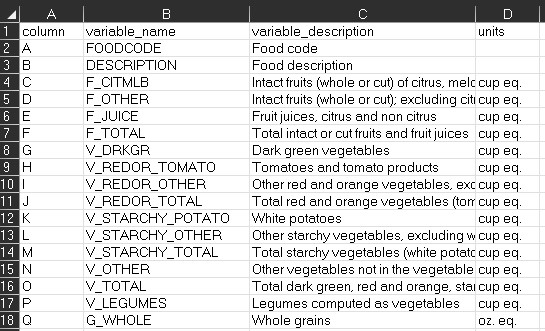
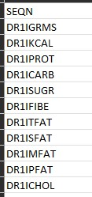

<style type="text/css">
h1.title {
  font-size: 38px;
  font-family: "Tahoma", sans-serif;
  color: #1F3600; /* darkgreen from DietDiveR logo */
}
h1 { /* Header 1 */
  font-size: 28px;
  color: #1F3600;
}
h2 { /* Header 2 */
    font-size: 22px;
  color: #1F3600;
}
h3 { /* Header 3 */
  font-size: 18px;
  color: #1F3600;
}
body{ /* Normal  */
  background-color: rgb(251, 251, 251);
  }
blockquote{ 
  font-size: 14px;
}
.list-group-item.active, .list-group-item.active:focus, .list-group-item.active:hover {
    background-color: #1F3600;
}
</style>

<br>

# Load functions and packages

Name the path to DietDiveR directory where input files are pulled.
```{r}
main_wd <- "~/GitHub/DietDiveR"
```

Install the foreign package if it is not installed yet.
```{r, eval=FALSE}
if (!require("foreign", quietly = TRUE)) install.packages("foreign")
```

<!-- Load foreign in the background-->
```{r, echo=FALSE}
library(foreign)
```

Load the necessary functions.
```{r}
source("lib/specify_data_dir.R")
source("lib/load_clean_NHANES.R")
source("lib/QCOutliers.R")
```

You can come back to the main directory by:
```{r, eval=FALSE}
  setwd(main_wd)
```

Specify the directory where the data is.
```{r, eval = FALSE}
SpecifyDataDirectory(directory.name= "eg_data/NHANES/")
```

```{r setup, include=FALSE}
knitr::opts_chunk$set(echo=TRUE)
knitr::opts_knit$set(root.dir = 'eg_data/NHANES')
```

<br>

# QC the food data

Here, we will filter food data by age, completeness, >1 food item reported/day, and complete data on both days.

Download demographics data (DEMO_I.XPT) from NHANES website.  
Name the file and destination. mod="wb" is needed for Windows OS. Other OS users may need to delete it.
```{r, eval=FALSE}
download.file("https://wwwn.cdc.gov/Nchs/Nhanes/2015-2016/DEMO_I.XPT", 
              destfile="Raw_data/DEMO_I.XPT", mode="wb")
```

Load the demographics file.
```{r}
demog <- read.xport("Raw_data/DEMO_I.XPT")
```

Demographics data has the age, gender, etc. of each participant. Read [documentation on demographics](https://wwwn.cdc.gov/Nchs/Nhanes/2015-2016/DEMO_I.htm) for details.

```{r}
head(demog, 1)
```

Only select the data of adults (18 years of age or older).
```{r}
adults <- demog[demog$RIDAGEYR >= 18, ]
```

Check the number of adults - should be 5,992.
```{r}
length(unique(adults$SEQN))
```

Load the formatted food data prepared in the previous section.
```{r}
Food_D1_FC_cc_f <- read.table("Food_D1_FC_cc_f.txt", sep="\t", header=T)
Food_D2_FC_cc_f <- read.table("Food_D2_FC_cc_f.txt", sep="\t", header=T)
```

Check the number of complete and incomplete data for each day. According to [the documentation](https://wwwn.cdc.gov/Nchs/Nhanes/2015-2016/DR1IFF_I.htm), `DR1DRSTZ` = 1 is complete data and values other than 1 are incomplete for Day 1. Same goes with `DR2DRSTZ` for Day 2.

Using the table function, we will find that 119,273 rows are complete for Day 1, and 98,778 rows for Day 2.
```{r}
table(Food_D1_FC_cc_f$DR1DRSTZ)  # Day 1
```

```{r}
table(Food_D2_FC_cc_f$DR2DRSTZ)  # Day 2
```

<br>

---

## Day 1

Subset only those with complete data (STZ==1) in `Food_D1_FC_cc_f`.
```{r}
food1 <- subset(Food_D1_FC_cc_f, DR1DRSTZ == 1)
```

Generate a vector of SEQN in food1, which is a list of participants.
```{r}
keepnames1 <- unique(food1$SEQN)  # Should be 8,326 names
```

Make a table with the number of food items they reported on day 1.
```{r}
freqtable1 <- as.data.frame(table(food1$SEQN))
```

Keep rows with more than 1 food item reported.
```{r}
freqtable1_m <- freqtable1[freqtable1$Freq > 1, ]
```

Change the column name for ID as "SEQN" for clarity.
```{r}
colnames(freqtable1_m)[1] <- "SEQN"
```

Keep the names of those who reported complete data and more than 1 food item per day.
```{r}
keepnames1_mult <- keepnames1[keepnames1 %in% freqtable1_m$SEQN] # 8,324
```

Select only adults from `keepnames1_mult`.
```{r}
keepnames1_mult_adults <- keepnames1_mult[keepnames1_mult %in% adults$SEQN] # 5,266
```

Select only the participants whose names are in `keepnames1_mult_adults`.
```{r}
food1b <- food1[food1$SEQN %in% keepnames1_mult_adults, ] # 78,442 rows
```

<br>

---

## Day 2

Subset only those with complete data (STZ==1).
```{r}
food2 <- subset(Food_D2_FC_cc_f, DR2DRSTZ == 1)
```

Generate a vector of SEQN in food2, which is a list of participants.
```{r}
keepnames2 <- unique(food2$SEQN)  # 6,875
```

Make a table with the number of food items they reported on day 2.
```{r}
freqtable2 <- as.data.frame(table(food2$SEQN))
```

Keep rows with more than 1 food item reported.
```{r}
freqtable2_m <- freqtable2[freqtable2$Freq > 1, ]
```

Change the column name for ID as "SEQN" for clarity.
```{r}
colnames(freqtable2_m)[1] <- "SEQN"
```

Keep the names of those who reported complete data and more than 1 food item per day.
```{r}
keepnames2_mult <- keepnames2[keepnames2 %in% freqtable2_m$SEQN] # 6,869
length(keepnames2_mult)
```

Select only adults from `keepnames2_mult`.
```{r}
keepnames2_mult_adults <- keepnames2_mult[keepnames2_mult %in% adults$SEQN] # 4,401
```

Select only the participants whose names are in `keepnames2_mult_adults`.
```{r}
food2b <- food2[food2$SEQN %in% keepnames2_mult_adults, ] # 66,690 rows
nrow(food2b)
```

Create a vector of SEQN of those that have both day 1 and day 2 data.
```{r}
food1bnames <- unique(food1b$SEQN)
food2bnames <- unique(food2b$SEQN)
keepnames12 <- food1bnames[food1bnames %in% food2bnames] 
```

Check the number of participants remained. 4,401 people met the criteria.
```{r}
length(keepnames12)
```

<br>

From here, procedures A and B serve the following purposes. (B consists of B-1, B-2, B-3, and B-4.)  
**Procedure A**: Further process food1b and food2b for building a food tree.  
**Procedure B-1-4**: Calculate totals from the QC-ed food items and QC totals.

# Procedure A: Further process food1b and food2b for building a food tree

Make a day variable to distinguish them.
```{r}
food1b$Day <- 1
food2b$Day <- 2
```

Copy these datasets to avoid overwriting.
```{r}
food1e <- food1b
food2e <- food2b
```

Remove the prefixes "DR1I", "DR1" from the columnnames.  
The `gsub` function replaces all matches with the specified pattern.
```{r}
colnames(food1e) <- gsub(colnames(food1e), pattern = "^DR1I", replacement = "")
colnames(food1e) <- gsub(colnames(food1e), pattern = "^DR1",  replacement = "")
colnames(food2e) <- gsub(colnames(food2e), pattern = "^DR2I", replacement = "")
colnames(food2e) <- gsub(colnames(food2e), pattern = "^DR2",  replacement = "")
```

Ensure the columns of food1c and food2c match before joining them.  
(returns TRUE if the two are identical)
```{r}
identical(colnames(food1e), colnames(food2e))
```

Combine food1 and food2 as a longtable (add food2 rows after food1 rows).
```{r}
food12e <- rbind(food1e, food2e)
```

Select only the individuals listed in `keepnames12`.
```{r}
food12f <- food12e[food12e$SEQN %in% keepnames12, ]
```

Add the demographic data to food12f. &rarr; This will further be QCed at the end of Procedure B-4.
```{r}
food12f_demo <- merge(x=food12f, y=demog, by="SEQN", all.x=T)
```

<br>

# Procedure B-1: Further process food1b and food2b for calculating totals and clustering

Copy datasets to avoid overwriting.
```{r}
food1bb <- food1b
food2bb <- food2b
```

Change "FoodAmt" back to "DR1GRMS" to be consistent with the variable names in dayXvariables.
```{r}
names(food1bb)[names(food1bb) == "FoodAmt"] <- "DR1IGRMS"
names(food2bb)[names(food2bb) == "FoodAmt"] <- "DR2IGRMS"
```

**[NOTE]** Create a set of variables to use downstream.

This will be more conveniently done by using spreadsheet software such as MS Excel rather than R. This process is to generate: <span style="text-decoration:underline">NHANES_Food_VarNames_FC_Day1.txt</span> and 
<span style="text-decoration:underline">NHANES_Food_VarNames_FC_Day2.txt</span> so that we will be able to select nutrients and food category variables and a few others that are necessary, out of many other variables present in the NHANES food data.

Appendix 2 of [food data documentation](https://wwwn.cdc.gov/Nchs/Nhanes/2015-2016/DRXFCD_I.htm#Appendix_2._Variables_in_the_Individual_Foods_Files_(DR1IFF_I_and_DR2IFF_I)_by_Position) shows the variables in the Individual Foods Files (DR1IFF_I and DR2IFF_I).

{width=60%}

<br>

However, we need food category information as well, similar to ASA24. Food category variables (Food Patterns Equivalents Database per 100 grams of FNDDS) can be found in the [FPED page](https://www.ars.usda.gov/northeast-area/beltsville-md-bhnrc/beltsville-human-nutrition-research-center/food-surveys-research-group/docs/fped-databases/). Select the same years of FPED as your NHANES release you are using. The variable labels  <span style="text-decoration:underline">(F_CITMLB through A_DRINKS, for FPED 2015-2016)</span> are the food category variables you need.

The first few lines of FPED_1516.xls

{width=80%}
<br>

Those two sets of variables need to come one after another vertically, so that they will form a long list of variables, for which we would like to calculate totals from the food data. 

Lastly, we need to have “FoodCode” and “FoodID” columns in order to build a food tree from our food data. So, add “FoodCode” and “FoodID” one per line, after the nutrients and food category variables in the lists of variables for Day 1 and Day 2 you have created.

If you are analyzing NHANES 2015-2016, this tutorial provides you with <span style="text-decoration:underline">NHANES_Food_VarNames_FC_Day1.txt</span> and <span style="text-decoration:underline">NHANES_Food_VarNames_FC_Day2.txt</span> files in the “Food_VarNames” folder. These two .txt files were generated following the steps described above and have the necessary variable names. If you are analyzing other releases of NHANES, create a spreadsheet workbook, and copy and paste the variables from the Appendix of the documentation of the selected version of NHANES and food category variables from the appropriate version of FPED. Remember to add “FoodCode” and “FoodID” at the end of them, too.

<br>

The first few lines of NHANES_Food_VarNames_FC_Day1.txt looks like as follows:

{width=15%}

<br>

---

## Select variables and combine Day 1 and Day 2

## Day 1

Import the list of variables to be selected in Day 1.
```{r}
day1variables <- read.table('Food_VarNames/NHANES_Food_VarNames_FC_Day1.txt', header=F)
```

Select the variables to pick up from the food data.
```{r}
var_to_use1 <- names(food1bb) %in% day1variables$V1
```

Select only the specified variables.
```{r}
food1c <- food1bb[, var_to_use1]
```

Remove "DR1T", "DR1" from the column names.
```{r}
colnames(food1c) <- gsub(colnames(food1c), pattern = "^DR1I", replacement = "")
colnames(food1c) <- gsub(colnames(food1c), pattern = "^DR1",  replacement = "")
```

Check the column names.
```{r}
colnames(food1c)
```

<br>

--- 

## Day 2
```{r}
day2variables <- read.table('Food_VarNames/NHANES_Food_VarNames_FC_Day2.txt', header=F)
var_to_use2 <- names(food2bb) %in% day2variables$V1
food2c <- food2bb[, var_to_use2]
colnames(food2c) <- gsub(colnames(food2c), pattern = "^DR2I", replacement = "")
colnames(food2c) <- gsub(colnames(food2c), pattern = "^DR2", replacement = "")
```

Make a day variable before combining `food1c` and `food2c`.
```{r}
food1c$Day <- 1
food2c$Day <- 2
```

Ensure the columns of food1c and food2c match, before joining them.
```{r}
identical(colnames(food1c), colnames(food2c))
```

If not, create a dataframe that has the column names of both `food1c` and `food2c`, and examine the column names side-by-side.
```{r}
names_df <- data.frame(matrix(nrow= max(ncol(food1c), ncol(food2c)), ncol=2))
colnames(names_df) <- c("food1c", "food2c")
names_df$food1c <- colnames(food1c)
names_df$food2c <- colnames(food2c)
```

```{r,eval=FALSE}
names_df
```

<details>
  <summary>Click to expand output</summary>
```{r, echo=FALSE, eval=TRUE}
names_df
```
</details>
<br>

Combine food1 and food2 as a longtable.
```{r}
food12c <- rbind(food1c, food2c)
```

Limit to only the individuals listed in `keepnames12`.
```{r}
food12d <- food12c[food12c$SEQN %in% keepnames12, ]
```

Add the demographic data to food12f for data overview. This will be QC-ed later at the end of this script.
```{r}
food12d_demo <- merge(x=food12d, y=demog, by="SEQN", all.x=T)
```

Save the combined and QC-ed food items as a .txt file.  
This has nutrient information, food categories, and day variable for each food item reported, and shall be used to calculate totals in B-2. **THIS WILL BE A VERY LARGE FILE.**
```{r}
write.table(food12d_demo, "Food_D12_FC_QC_demo.txt", sep="\t", quote=F, row.names=F)  
```

<br>

You may also want to consider special diets that some participants are following: e.g. DASH diet, diabetic diet, etc. Depending on your research question, you may want to exclude those following special diets. The diet information is found in metadata attached to totals day 1. We will revisit diet information in the next section.

<br>

# B-2: Calculate totals/day/participant with the food data of the selected SEQNs

Load the QC-ed food items.
```{r}
food12d_demo <- read.table("Food_D12_FC_QC_demo.txt", sep="\t", header=T)
```
This has "FoodID" and "FoodCode" columns. 
   
Calculate totals for day 1 and day 2, from the first.val argument through the last.val argument and combine the two datasets.
```{r}
TotalNHANES(food12d= food12d_demo,
            first.val= "GRMS",    
            last.val=  "A_DRINKS", 
            outfn= "Total_D12_FC_QC_eachday.txt")  
```

Load the resultant total for each day.
```{r}
total12d <- read.table("Total_D12_FC_QC_eachday.txt", sep="\t", header=T)
```

`total12d` has the sum of each variable (columns) for each day and participant.
```{r}
head(total12d, 2)
```

Merge total12d and demographics by SEQN.
```{r}
total12d_demo <- merge(x= total12d, y=demog, by="SEQN", all.x=TRUE)
```

Save it as a .txt file.
```{r}
write.table(total12d_demo, "Total_D12_FC_QC_eachday_demo.txt", sep="\t", quote=F, row.names=F)
```

<br>

# B-3: Calculate the mean across days totals/participant

Calculate the mean of the two days of the totals data per participant.
```{r}
AverageTotalNHANES(total12d= total12d, 
                   first.val= "GRMS", 
                   last.val= "NoOfItems", 
                   outfn= "Total_D12_FC_QC_mean.txt")  
```

Load the mean total.
```{r}
meantotal12d <- read.table("Total_D12_FC_QC_mean.txt", sep="\t", header=T)
```

Add demographic data to mean total. 
Merge QC-totals and demographics by SEQN.
```{r}
meantotal12d_demo <- merge(x= meantotal12d, y=demog, by="SEQN", all.x=TRUE)
```


<br>

# B-4: QC the mean total in the same way as ASA24

For individual food data, there is no code for cleaning.  
Based on other data and analysis we do not expect outliers to severely affect main analysis conclusions ([ASA24 data cleaning doc](https://epi.grants.cancer.gov/asa24/resources/asa24-data-cleaning-2020.pdf)). However, it is always a good idea to take a look at the distributions of any of your variables of interest. You can calculate totals by occasion, similar to what is described in the ASA24 tutorial.

---

For totals, the same QC can be applied as ASA24 totals QC procedure.  
Totals data may contain outliers due to errors in dietary reporting. These errors may be due to omission or inaccurate over- or under-estimation of portion size, leading to improbable nutrient totals. ASA24 provides [General Guidelines for Reviewing & Cleaning Data](https://epi.grants.cancer.gov/asa24/resources/cleaning.html#guidelines) for identifying and removing suspicious records. 
  
Here, we will identify records that contain values that fall outside typically observed ranges of kilocalories (KCAL), protein (PROT), total fat (TFAT), and vitamin C (VC). The ASA24 guide provides ranges of beta carotene (BCAR), too, however, outlier checking for BCAR is omitted in this tutorial but can be considered if you identify it as a nutrient that has a high variance in your study dataset.

> **[NOTE]** Your input dataframe (QCtotals) will be overwritten after each outlier removal.
>
> Run all these QC steps in this order. When asked, choose to remove the outliers that fall outside the specified range for each nutrient.

<br>

Split your dataset to males and females because different thresholds apply for males and females.
```{r}
meantotal12d_demo_M <- subset(meantotal12d_demo, RIAGENDR==1)  
meantotal12d_demo_F <- subset(meantotal12d_demo, RIAGENDR==2)  
```

<br>

---

## QC for males

Define your males totals dataset to be used as input.
```{r}
QCtotals <- meantotal12d_demo_M
```

Flag if KCAL is <650 or >5700 &rarr; ask remove or not &rarr; if yes, remove those rows.
```{r, eval=FALSE}
QCOutliers(input.data = QCtotals, 
           target.colname = "KCAL", min = 650, max = 5700)
```

This function will print out rows that fall outside the specified min-max range, and a dialogue box will appear outside the R Studio (shown below), asking whether to remove them. You should make sure to review these records carefully to double-check if the removal is warranted. It is possible to have a valid record that could meet the threshold for removal. Only you will know if you can trust the record when working with real data.


If you find potential outlier(s) here, click "No", and view those total(s) with their other nutrient intake information by running the following;
```{r}
KCAL_outliers <- subset(QCtotals, KCAL < 650 | KCAL > 5700)     
```

Sort the rows by KCAL and show only the specified variables.
```{r, eval=FALSE}
KCAL_outliers[order(KCAL_outliers$KCAL, decreasing = T),
              c('SEQN', 'KCAL', 'GRMS', 'PROT', 'TFAT', 'CARB')]  
```

<details>
  <summary>Click to expand output</summary>
```{r, echo=FALSE, eval=TRUE}
KCAL_outliers[order(KCAL_outliers$KCAL, decreasing = T),
              c('SEQN', 'KCAL', 'GRMS', 'PROT', 'TFAT', 'CARB')]  
```
</details>
<br>


If you think they are true outlier(s), then run the QCOutliers command for KCAL again, and click "Yes" to remove the outlier. Here for this tutorial, we will remove this individual.
```{r}
QCOutliers(input.data = QCtotals, 
           target.colname = "KCAL", min = 650, max = 5700)
```

Continue the QC process with other variables.

Flag if PROT is <25 or >240 &rarr; ask remove or not&rarr; if yes, remove those rows.
```{r}
QCOutliers(input.data = QCtotals, 
           target.colname = "PROT", min = 25, max = 240)
```

Flag if TFAT is <25 or >230 &rarr; ask remove or not &rarr; if yes, remove those rows.
```{r}
QCOutliers(input.data = QCtotals, 
           target.colname = "TFAT", min = 25, max = 230)
```

Flag if VC (Vitamin C) is <5 or >400 &rarr; ask remove or not &rarr; if yes, remove those rows.
```{r}
QCOutliers(input.data = QCtotals,  
           target.colname = "VC", min = 5, max = 400)
```


<br>

Name the males totals after QC.
```{r}
QCed_M <- QCtotals
```


<br>

---

## QC for females

Define your female totals dataset to be used as input.
```{r}
QCtotals <- meantotal12d_demo_F  
```

Flag if KCAL is <600 or >4400 &rarr; ask remove or not &rarr; if yes, remove those rows.
```{r}
QCOutliers(input.data = QCtotals, target.colname = "KCAL", min = 600, max = 4400)
```

Flag if PROT is <10 or >180 &rarr; ask remove or not &rarr; if yes, remove those rows
```{r}
QCOutliers(input.data = QCtotals, target.colname = "PROT", min = 10, max = 180)
```

Flag if TFAT is <15 or >185 &rarr; ask remove or not &rarr; if yes, remove those rows
```{r}
  QCOutliers(input.data = QCtotals, target.colname = "TFAT", min = 15, max = 185)
```

Flag if VC (Vitamin C) is <5 or >350 &rarr; ask remove or not &rarr; if yes, remove those rows.
```{r}
QCOutliers(input.data = QCtotals, target.colname = "VC", min = 5, max = 350)
```

<br>

Name the females totals after QC.
```{r}
QCed_F <- QCtotals
```

<br>

---

Combine the rows of M and F. 
```{r}
QCtotals_MF <- rbind(QCed_M, QCed_F)
```


Now, you have prepared formatted and QC-ed food items, totals for each day, and mean totals across two days for each participant.

<br>

# Adjust totals and items after QC

## Remove the QC-ed individual(s) from the totals each day

In the previous section, we have removed individual(s) that did not pass the QC from mean total data. We will remove those individual(s) from the totals (calculated in B-2, before taking means of days), so that we will have the same individuals in QC-ed mean_total and total for each day.

Among the individuals in total12d_demo, select only those in QCtotals_MF.
```{r}
total12d_demo_QCed <- total12d_demo[total12d_demo$SEQN %in% QCtotals_MF$SEQN, ]
```

Save as a .txt file. This will be the total for each of the "QC-ed" individuals for each day, if you would like to perform clustering analyses with Day 1 and Day 2 separately.
```{r}
write.table(total12d_demo_QCed, "Total_D12_FC_QC_eachday_demo_QCed.txt", sep="\t", quote=F, row.names=F)
```

<br>

## Similarly, remove the QC-ed individual(s) from the food items to be consistent with the QC-ed averaged totals

Among the individuals in food12f_demo (generated in Procedure A), select only those in QCtotals_MF.
```{r}
food12f_demo_QCed <- food12f_demo[ food12f_demo$SEQN %in% QCtotals_MF$SEQN, ]
```

Save as a .txt file. This will be the items for each of the "QC-ed" individuals for each day, to be used for ordination etc.
```{r}
write.table(food12f_demo_QCed, "Food_D12_FC_QC_demo_QCed.txt", sep="\t", quote=F, row.names=F)
```

<br>

---

Come back to the main directory before you start running another script.
```{r, eval=FALSE}
  setwd(main_wd)
```

<!-- This is to remove big white space at the end of the rendered html, which is produced due to toc_floating.  Source: https://stackoverflow.com/questions/52933437/how-to-remove-white-space-at-the-end-of-an-rmarkdown-html-output -->
<div class="tocify-extend-page" data-unique="tocify-extend-page" style="height: 0;"></div>
