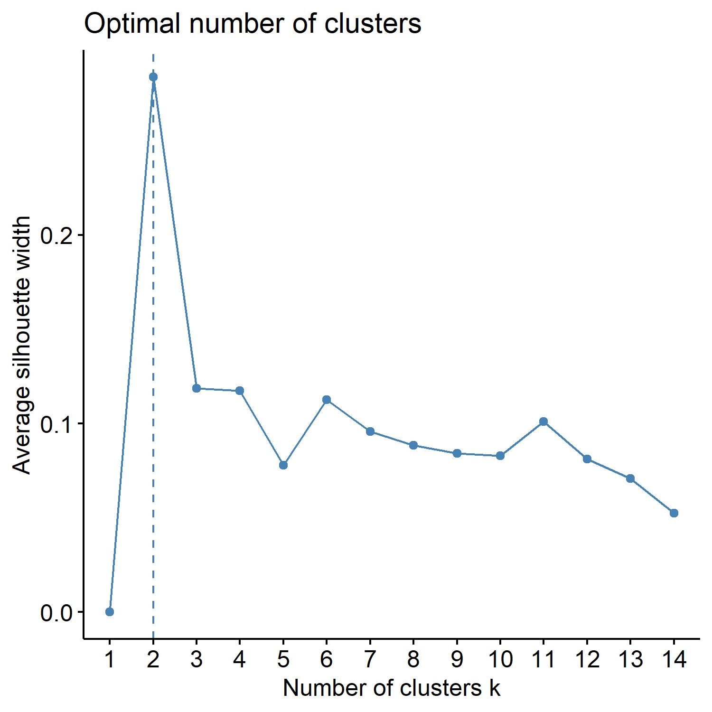

<style type="text/css">
h1.title {
  font-size: 38px;
  font-family: "Tahoma", sans-serif;
  color: #1F3600; /* darkgreen from DietDiveR logo */
}
h1 { /* Header 1 */
  font-size: 28px;
  color: #1F3600;
}
h2 { /* Header 2 */
    font-size: 22px;
  color: #1F3600;
}
h3 { /* Header 3 */
  font-size: 18px;
  color: #1F3600;
}
body{ /* Normal  */
  background-color: rgb(251, 251, 251);
  }
blockquote{ 
  font-size: 14px;
}
.list-group-item.active, .list-group-item.active:focus, .list-group-item.active:hover {
    background-color: #1F3600;
}
</style>

<br>

# Introduction

Here, we will run k-means analysis with the NHANES 2-day average totals, subsetted for males, 60-79 years old.

Create two folders named "males60to79_Nut_k-means" and "males60to79_Cat_k-means" inside "Laboratory_data" to save k-means results of Nutrients and Food Category data, respectively.

<br>

# Load functions and packages  

Name the path to DietDiveR directory where input files are pulled.
```{r}
main_wd <- "~/GitHub/DietDiveR"
```

Load necessary packages.
```{r}
library(ggplot2)
library(ggfortify)
library(cluster)
library(factoextra)
```

Set your ggplot2 theme.
```{r}
theme_set(theme_bw(base_size = 14))
```

Import source code to run the analyses to follow.Load the necessary functions.
```{r}
source("lib/specify_data_dir.R")
source("lib/k-means.R")
```

You can come back to the main directory by:
```{r, eval=FALSE}
setwd(main_wd)
```

Specify the directory where the data is.
```{r, eval=FALSE}
SpecifyDataDirectory(directory.name = "eg_data/NHANES/Laboratory_data/")
```

```{r setup, include=FALSE}
knitr::opts_chunk$set(echo=TRUE)
knitr::opts_knit$set(root.dir = 'eg_data/NHANES/Laboratory_data/')
```

<br>  

# Nutrient data, processed for clustering analyses

Your input data should be a data frame with uncorrelated variables with non-zero variance and with no missing data.
```{r}
nut_kmeansinput <- read.table("QCtotal_d_ga_body_meta_glu_comp_2_males60to79_c_Nut_rv.txt",
                              sep="\t", header=T)
```

Ensure your input file has the correct number of rows and columns.
```{r}
dim(nut_kmeansinput)
```

Scale your input file and name it as k-means_input.
```{r}
kmeans_input <- scale(nut_kmeansinput)
```

Specify the directory (folder) to save the results. (create a folder named as this if not done so)
```{r}
res_dir_nut = "males60to79_Nut_k-means"
```

Specify the prefix of filenames to be saved.
```{r}
res_prefix_nut = "males60to79_Nut"
```

Run the elbow, silhouette, and gap methods to find an optimum K (number of clusters).

Do not alter the name of the input file: kmeans_input. This function below assumes that the input is named as "kmeans_input". You can only run those three methods for K = 1 through {number of observations - 1}. The gap method output will be printed on the Console. The gap values are plotted in xxx_gapmethod.pdf.
```{r}
ChooseK(out.dir= res_dir_nut, out.prefix= res_prefix_nut)
```

The Gap method output on the console may say "Warning message: did not converge in 10 iterations."

If this happens, the optimum K suggested may not be as conclusive, but we can proceed for now while keeping that in mind.

As we saw in the k-means analysis with ASA24 data, this code will generate three output files all at once in the res_dir_xxx:

Output file postfix    |	File content
-------------------    | ---------------------------------------------------------------
_elbowmethod.pdf	     |	Shows total within−clusters sum of squares for each K.
_gapmethod.pdf	       |	Shows the Gap statistic (k) for each K, and if the factoextra package is used, the optimal K is marked by a dotted line.
_silhouettemethod.pdf	 |	Shows the Average silhouette width (~ goodness of fit) for each K, and if the factoextra package is used, the optimal K is marked by a dotted line.

<br>

Look at the three figures generated by the ChooseK function above. The elbow and gap method did not give a distinct peak (though the gap method indicates K=2 might be optimal), but the silhouette methods gave a peak at K=2.

{width=50%}

<br>

{width=50%}

<br>

{width=50%}

<br>

With specific K values in mind, perform k-means analysis with one specified K. Also, change the file name to be saved as a PDF. This uses the factoextra package.
```{r}
OneK(myK= 2, out.dir= res_dir_nut, out.fn = "males60to79_Nut_K2")
```

```{r,out.width="70%"}
oneKplot
```

<br>

---

Or try multiple Ks and print respective biplots in one panel.

Likewise, change the file name to be saved as a PDF as necessary. This uses the factoextra and gridExtra packages.
```{r}
MultipleK(myKs = c(2,3,4,5), out.dir = res_dir_nut, out.fn = "males60to79_Nut_K2-5")
```

<br>

# Food category data, processed for clustering analyses

Your input data should be a data frame with uncorrelated variables with non-zero variance and with no missing data.
```{r}
cat_kmeansinput <- read.table("QCtotal_d_ga_body_meta_glu_comp_2_males60to79_c_Cat_rv.txt", 
                              sep="\t", header=T)
```

Ensure your input file has the correct number of rows and columns.
```{r}
dim(cat_kmeansinput)
```

Scale your input file and name it as k-means_input.
```{r}
kmeans_input <- scale(cat_kmeansinput)
```

Specify the directory (folder) to save the results.
```{r}
res_dir_cat = "males60to79_Cat_k-means"
```

Specify the prefix of filenames to be saved. 
```{r}
res_prefix_cat = "males60to79_Cat"
```

Run the elbow, silhouette, and gap methods to find an optimum K (number of clusters). Do not alter the name of the input file: kmeans_input. This function below assumes that the input is named as "kmeans_input". You can only run those three methods for K = 1 through {number of observations - 1}. The gap method output will be printed on the Console. The gap values are plotted in xxx_gapmethod.pdf.
```{r}
ChooseK(out.dir= res_dir_cat, out.prefix= res_prefix_cat)
```

Look at the three figures generated by the ChooseK function above. The elbow and gap method did not give a distinct peak (though the gap method indicates K=2 might be optimal), but the silhouette method gave a peak at K=3.


{width=50%}

<br>

{width=50%}

<br>

{width=50%}


With specific K values in mind, perform k-means analysis with one specified K. Also, change the file name to be saved as a PDF. 
```{r}
OneK(myK= 3, out.dir= res_dir_cat, out.fn = "males60to79_Cat_K3")
```

```{r,out.width="70%"}
oneKplot
```

Or try multiple Ks and print respective biplots in one panel.

Likewise, change the file name to be saved as a PDF as necessary. This uses the factoextra and gridExtra packages.
```{r}
MultipleK(myKs = c(2,3,4,5), out.dir = res_dir_cat, out.fn = "males60to79_Cat_K2-5")
```

---

Come back to the main directory.
```{r, eval=FALSE}
setwd(main_wd)
```

<!-- This is to remove big white space at the end of the rendered html, which is produced due to toc_floating.  Source: https://stackoverflow.com/questions/52933437/how-to-remove-white-space-at-the-end-of-an-rmarkdown-html-output -->
<div class="tocify-extend-page" data-unique="tocify-extend-page" style="height: 0;"></div>
