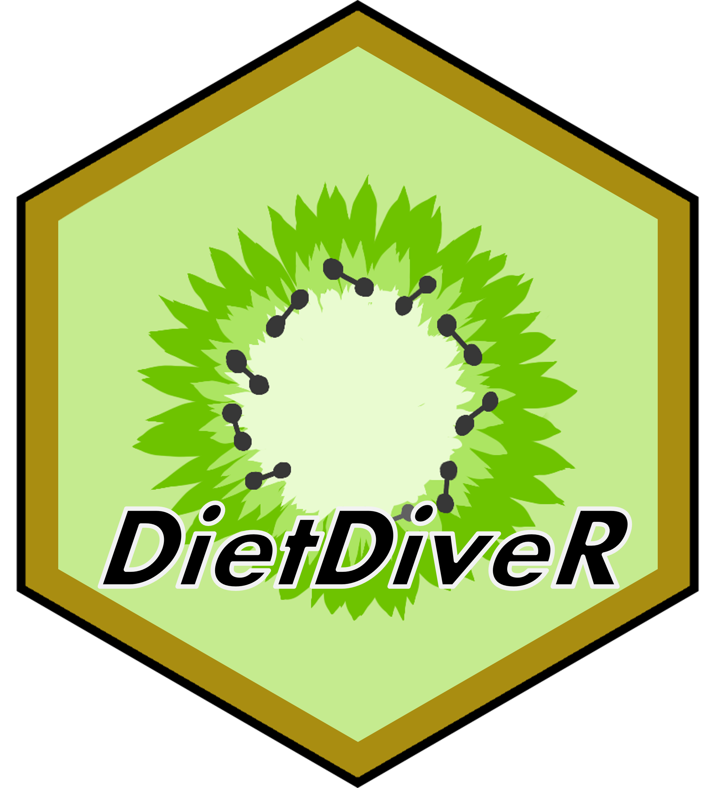

# **Welcome to DietDiveR tutorial!**

This tutorial shows how to analyze ASA24 and NHANES data.

## Get started

1. Download the [whole repository of DietDiveR](https://github.com/computational-nutrition-lab/DietDiveR). It contains files and scripts used in this tutorial.

2. The easiest way to follow along this tutorial is to create "documents/Github" folder in your home directory and bring unzipped DietDiveR repository there, so that you can run tutorial code without modifying paths.

3. Click on "ASA24" or "NHANES" with an inverted triangle on the header on this page to select tutorial materials that you would like to view. The analysis progresses from top to bottom, so we recommend starting from the top items named "load and clean ASA24 data" and "load and clean NHANES - 1".

4. See the [links page](https://computational-nutrition-lab.github.io/DietDiveR/Links.html) for additional resources for using R.

## [Computational Nutrition Lab](https://abbyj6.wixsite.com/website)

<!-- <a href = "https://xxxxx.github.io"> # if you want to put a link on the imaage -->

</a>

